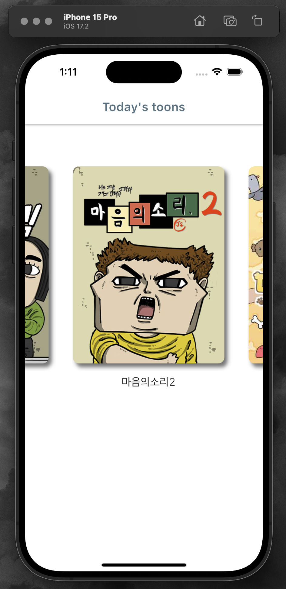
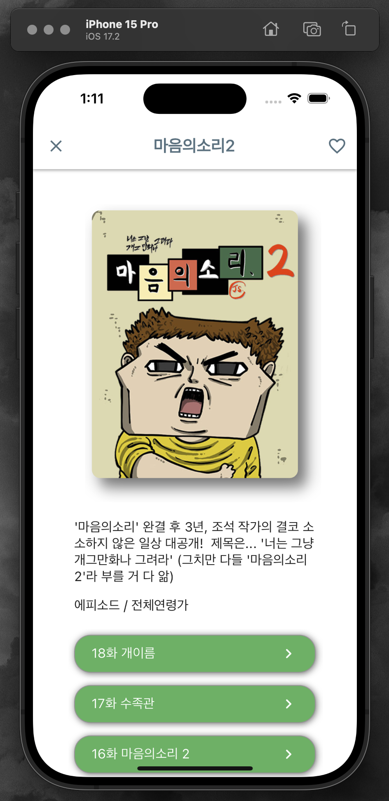
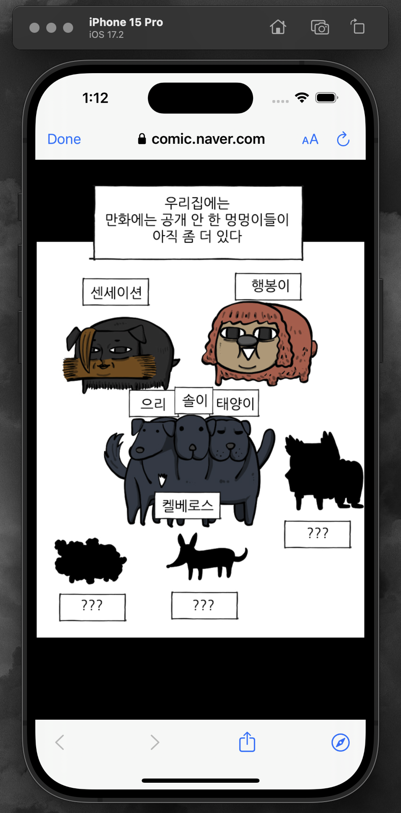

# Webtoon App

## 프로젝트 소개

이 프로젝트는 웹툰을 탐색하고 읽을 수 있는 애플리케이션입니다. 
사용자가 웹툰을 선택하면 해당 시리즈의 목록이 보이고, 원하는 웹툰을 선택하면 본문을 읽을 수 있는 구조로 되어 있습니다.

## 주요 기능

- **오늘의 웹툰**: 메인 화면에는 사용자가 선택할 수 있는 다양한 웹툰 시리즈가 표시됩니다.

- **시리즈 별 탐색**: 각 웹툰 시리즈를 선택하면 해당 시리즈의 웹툰 목록이 나타납니다.

- **웹툰 본문 보기**: 웹툰 목록에서 웹툰을 선택하면 해당 웹툰의 본문을 읽을 수 있습니다.

## 기술적 구현

- **네비게이션**: 사용자가 웹툰을 선택할 때마다 적절한 화면으로 전환되는 네비게이션 로직을 구현했습니다.

- **디자인**: 실제 웹툰 앱의 느낌을 살리기 위해 사용자 인터페이스를 세심하게 디자인했습니다.

  
  
  

